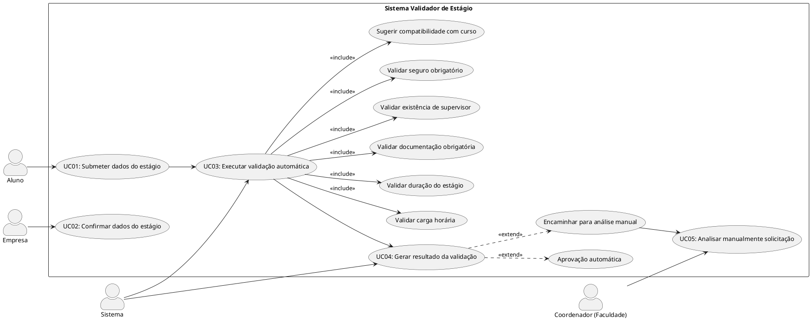
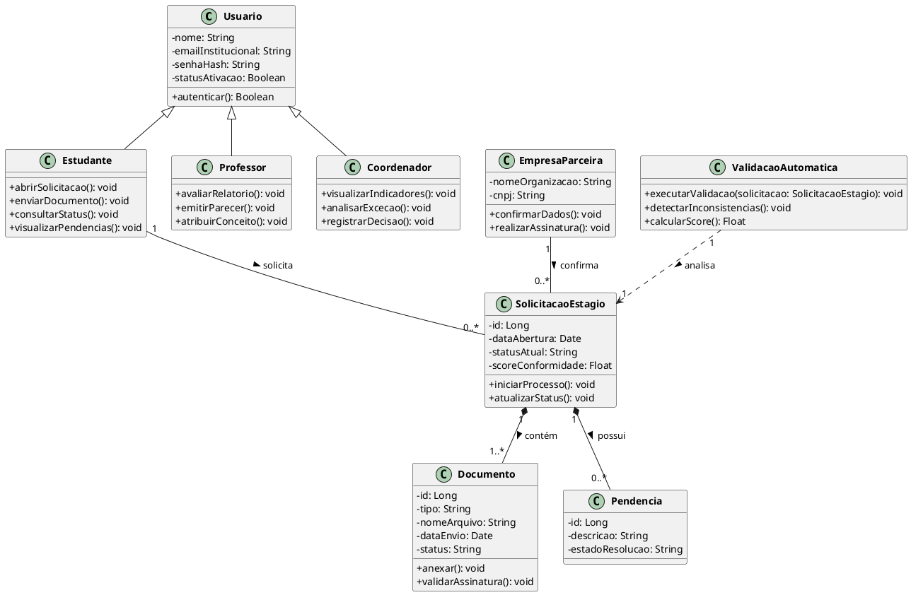

```markdown
---
id: sistema_validador_estagio
title: Documentação Técnica - Sistema Validador de Estágio
---

## 1. Diagrama de Casos de Uso



### 1.1 Visão Geral e Dinâmica do Sistema

O diagrama de casos de uso estrutura o fluxo do **Sistema Validador de Estágio**, integrando discentes, o setor corporativo e a instituição de ensino.

* **Papel dos Atores**:
* **Aluno**: Inicia o processo inserindo dados do contrato e documentos iniciais.
* **Empresa**: Atua como agente de conformidade, validando a exatidão das informações.
* **Sistema**: Núcleo de processamento lógico que verifica normas regulatórias e toma decisões de roteamento.
* **Coordenador**: Trata exceções e casos que exigem discernimento humano para aprovação ou indeferimento.


---

## 2. Diagrama de Classes



### 2.1 Descrição das Classes

* **Usuario**: Classe base com dados comuns de autenticação (nome, e-mail institucional, senha).
* **Estudante**: Aluno que solicita a validação, envia documentos e consulta status.
* **Professor**: Docente responsável pela análise acadêmica e atribuição de conceitos.
* **Coordenador**: Responsável pelo acompanhamento gerencial e análise de exceções.
* **SolicitacaoEstagio**: Classe central que armazena a data de abertura, status atual e score de conformidade.
* **ValidacaoAutomatica**: Módulo que aplica regras legais aos documentos e detecta inconsistências.

---

## 3. Versionamento

| Data | Versão | Descrição | Autor(es) |
| --- | --- | --- | --- |
| 16/04/2026 | 1.0 | Definição inicial das classes e casos de uso principais | Lucas Calil |
| 17/04/2026 | 1.1 | Inclusão de validação automática e notificações | Lucas Calil |
| 15/05/2026 | 2.0 | Ajustes finais nos relacionamentos e consolidação | Marco Antonio e Lucas Calil |

```

```