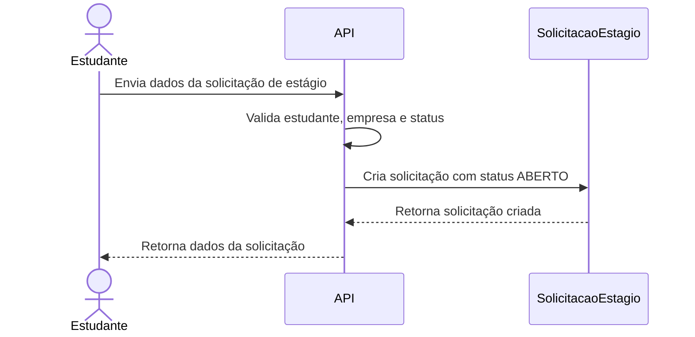
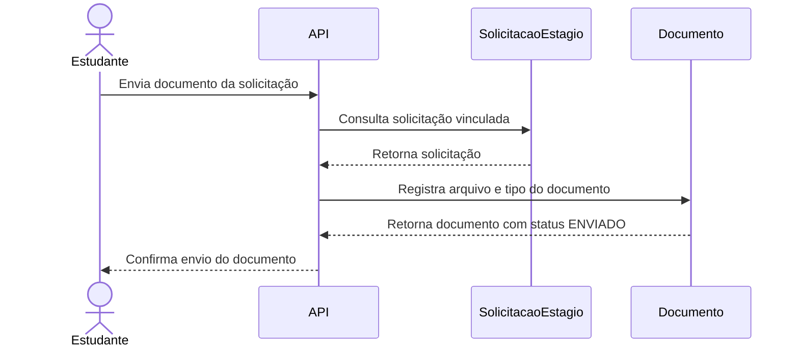
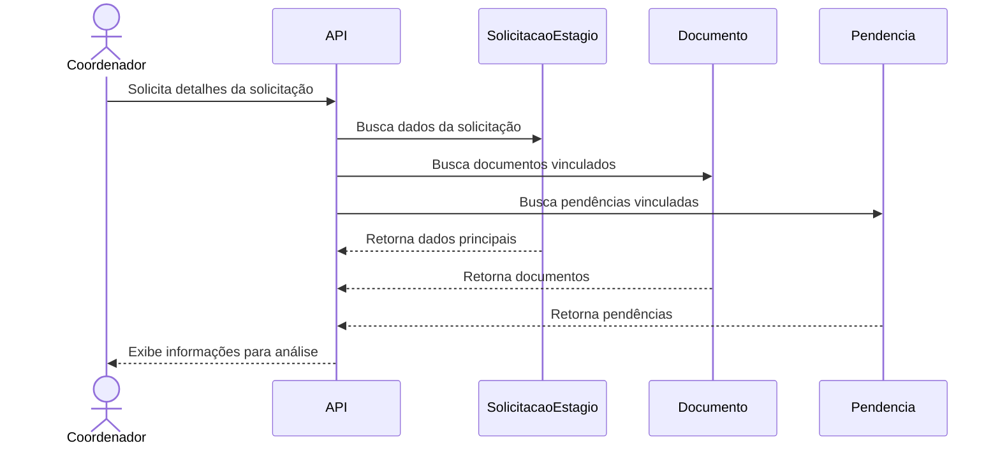
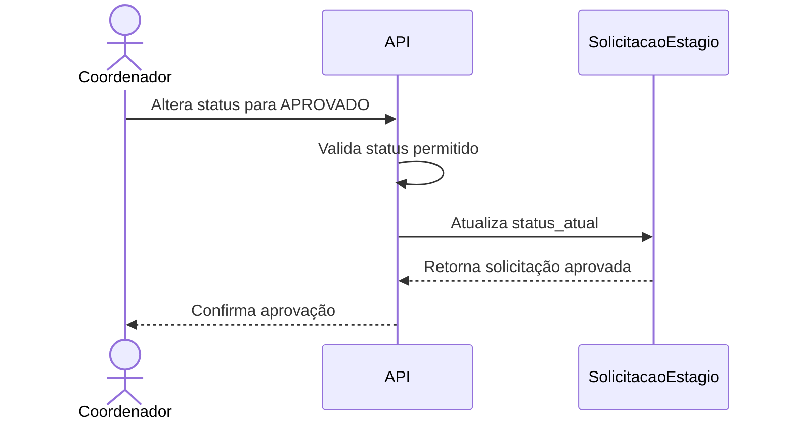
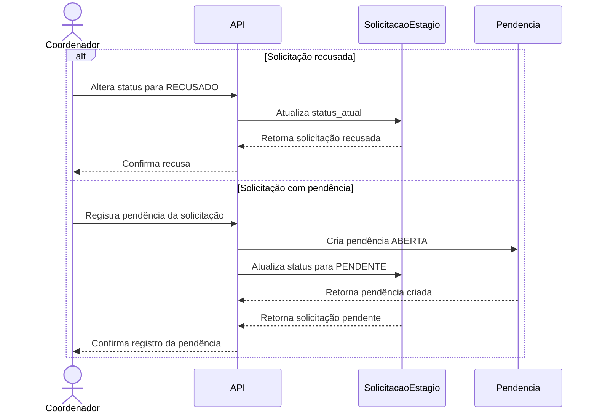

# Diagrama de Sequência

Este documento apresenta fluxos principais do Sistema Validador de Estágio usando diagramas de sequência em Mermaid.

## 1. Estudante cria solicitação de estágio

## 2. Estudante envia documento

## 3. Coordenador analisa solicitação

## 4. Coordenador aprova solicitação

## 5. Coordenador rejeita solicitação ou cria pendência

