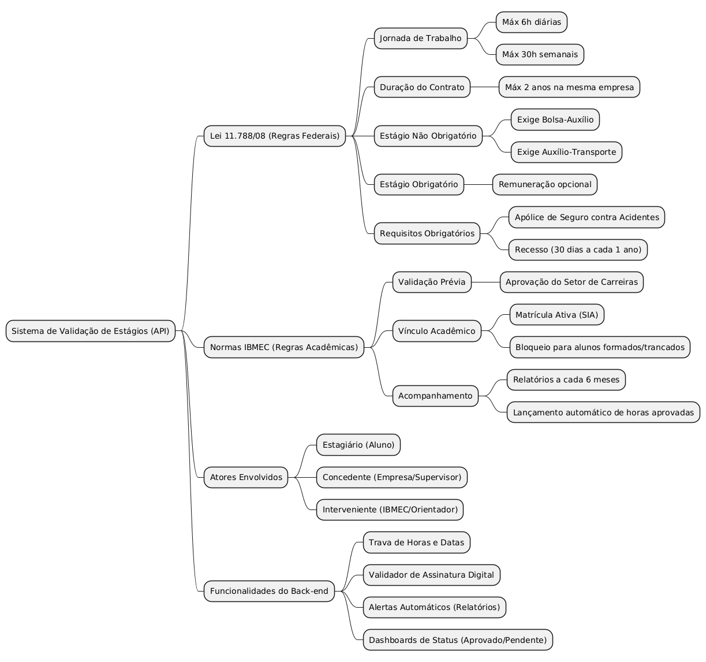

 
## Introdução
 

Mapa mental consiste em criar resumos cheios de símbolos, cores, setas e frases de efeito com o objetivo de organizar o conteúdo e facilitar associações entre as informações destacadas. Esse material é muito indicado para pessoas que têm facilidade de aprender de forma visual, auxiliando a equipe a compreender a estrutura geral do projeto de validação de estágios.

 
## Metodologia
 

Foram levantados os pontos críticos sobre as regras de negócio da API de validação (Lei nº 11.788/08, regulamento do IBMEC, 5W2H e Brainstorm) e, assim, foi produzido o mapa mental. O documento foi construído utilizando a ferramenta PlantUML para representar a arquitetura lógica e as restrições do sistema.

 
## Mapa mental - Geral
 
## Versão 1.0
 
### Mapa mental 1: Ecossistema de Validação de Estágios
 

## Conclusão
 

O mapa mental atua como uma ficha de estudos que ajuda a dar uma visão geral do ecossistema do projeto, facilitando a fixação dos pontos mais importantes sobre a legislação vigente e as normas institucionais que a API deve obrigatoriamente respeitar e validar.

 
## Referências Bibliográficas

- BRASIL. Lei nº 11.788, de 25 de setembro de 2008.

- IBMEC Manual para gerar Termo de Compromisso de Estágio - TCE.
 
- PlantUML: Open-source tool that uses simple textual descriptions to draw UML diagrams. Disponível em: https://plantuml.com/
 
## Versionamento
| Data | Versão | Descrição | Autor(es) |
| -- | -- | -- | -- |
| 10/04/2026 | 1.0 | Criação do documento  | Marco Antonio |
| 10/04/2026 | 1.0 | Adicionando imagem    | Lucas Calil   |